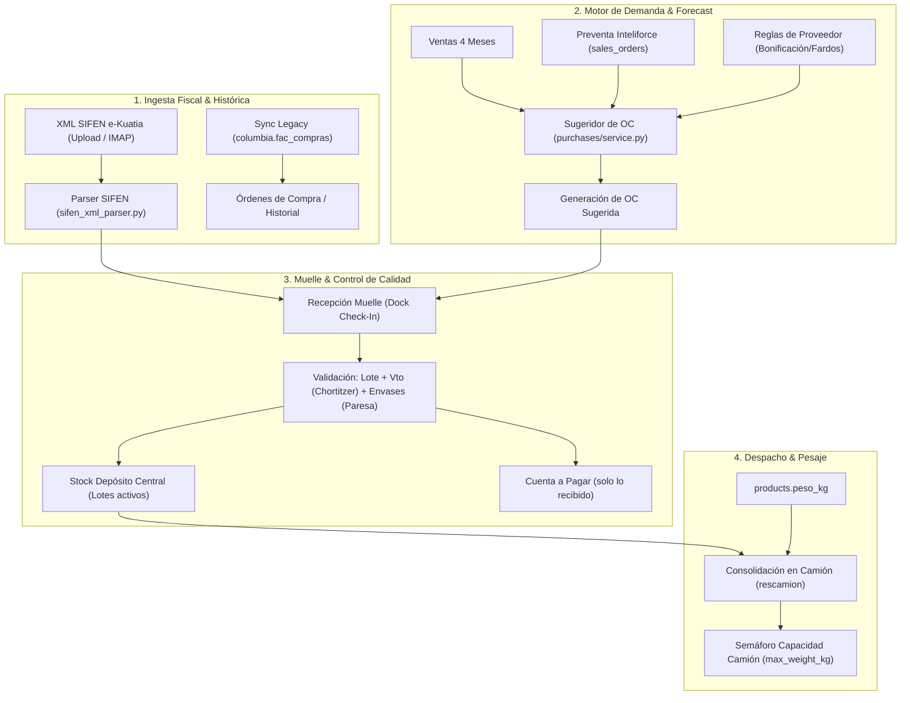

# Motor de Compras Inteligente y Reglas de Proveedores — Plan de Implementación

> **For agentic workers:** REQUIRED SUB-SKILL: Use superpowers:subagent-driven-development to implement this plan task-by-task. Steps use checkbox (`- [ ]`) syntax for tracking.

**Goal:** Implementar en la vertical Distribuidora (Casa Gonzalito) un Motor de Compras Inteligente con ingesta de facturas electrónicas SIFEN (XML e-Kuatia), reglas comerciales específicas para proveedores locales (Paresa, Chortitzer, Trociuk), cálculo de demanda considerando la preventa de Inteliforce, recepción física en muelle con Lote y Vencimiento, y control de tonelaje/pesaje de camiones.

**Architecture:** Se extiende el módulo de compras de Intelimarket (`api/src/purchases/`) incorporando un sub-motor de reglas por proveedor (`supplier_rules`), cotejo de demanda con pedidos pendientes de preventa en calle, validación de vida útil mínima en muelle, parser SIFEN e-Kuatia para cotejo automático de ítems y cálculo de peso acumulado por camión en despacho (`rescamion`).

**Architecture Diagram:**

**Tech Stack:** Python 3.11, FastAPI, SQLAlchemy (Asyncpg), PostgreSQL 16, TypeScript, React 18, Tailwind CSS, Lucide Icons, SIFEN XML DTE (e-Kuatia).

**Spec:** [`docs/superpowers/specs/2026-09-28-compras-inteligentes-proveedores-design.md`](file:///Users/gustaquevedo/Library/CloudStorage/OneDrive-Personal/Dev/Intelimarket-Distribuidora/docs/superpowers/specs/2026-09-28-compras-inteligentes-proveedores-design.md)

## Global Constraints

- Exclusivamente rama `vertical/distribuidora`. Prohibido checkout a otras ramas o git stash a ciegas.
- Blindaje absoluto: `Dashboard.tsx` y `Layout.tsx` no se tocan.
- Moneda 100% canónica: Guaraníes (PYG) con separador de miles canónico (`CurrencyInput`).
- Verificación estricta: cada tarea debe compilar limpiamente con `./ui-web/node_modules/.bin/tsc -b ui-web` y pasar pruebas con `pytest`.

---

### Task 1: Modelo y Parametrización de Reglas Comerciales de Proveedores (`supplier_rules`)

**Files:**
- Modify: `api/src/purchases/models.py`
- Modify: `api/src/purchases/schemas.py`
- Modify: `api/src/purchases/service.py`
- Test: `tests/api/test_supplier_rules.py`

**Interfaces:**
- Consumes: Modelo `Supplier` existente en `api/src/purchases/models.py`.
- Produces: Campos de reglas: `admite_bonificaciones` (bool), `control_envases` (bool), `vida_util_minima_dias` (int), `unidad_compra_minima` (str), `escalas_costo_volumen` (JSON).

- [ ] **Step 1: Write the failing test**
  Escribir `tests/api/test_supplier_rules.py` verificando que un proveedor pueda registrar sus reglas específicas (ej. Paresa con control de envases y bonificaciones; Chortitzer con vida útil mínima de 20 días).
- [ ] **Step 2: Run test to verify it fails**
  Ejecutar `pytest tests/api/test_supplier_rules.py -v`.
- [ ] **Step 3: Implement minimal code**
  Agregar columnas en `api/src/purchases/models.py` (o tabla asociada `supplier_rules`), actualizar `schemas.py` y el servicio CRUD.
- [ ] **Step 4: Run test to verify it passes**
  Ejecutar `pytest tests/api/test_supplier_rules.py -v` y verificar PASS.
- [ ] **Step 5: Commit**
  `git add api/src/purchases/ tests/api/test_supplier_rules.py && git commit -m "feat(purchases): supplier commercial rules model and schemas"`

---

### Task 2: Motor de Forecast y Sugerencia de OC con Demanda Preventa de Inteliforce

**Files:**
- Modify: `api/src/purchases/service.py`
- Modify: `api/src/purchases/router.py`
- Test: `tests/api/test_purchase_suggestions_distribuidora.py`

**Interfaces:**
- Consumes: Ventas históricas (4 meses) de `sales` + Pedidos pendientes de `sales_orders` (Inteliforce) + `supplier_rules`.
- Produces: Endpoint `/v1/companies/{company_id}/purchase-suggestions` con `cantidad_sugerida`, múltiplos de fardo y sugerencias de bonificación.

- [ ] **Step 1: Write the failing test**
  Escribir `tests/api/test_purchase_suggestions_distribuidora.py` simulando stock físico = 50, ventas históricas de 10/día, pedidos en calle pendientes de 40 unidades, validando que el déficit compense el stock comprometido y redondee a fardo x6.
- [ ] **Step 2: Run test to verify it fails**
  Ejecutar `pytest tests/api/test_purchase_suggestions_distribuidora.py -v`.
- [ ] **Step 3: Implement minimal code**
  Actualizar `calculate_smart_purchase_suggestions` en `api/src/purchases/service.py` para sumar los pedidos pendientes de Inteliforce y aplicar redondeo por empaque y disparadores de bonificación.
- [ ] **Step 4: Run test to verify it passes**
  Ejecutar `pytest tests/api/test_purchase_suggestions_distribuidora.py -v` y verificar PASS.
- [ ] **Step 5: Commit**
  `git add api/src/purchases/service.py tests/api/test_purchase_suggestions_distribuidora.py && git commit -m "feat(purchases): demand forecast considering pending inteliforce orders and pack rounding"`

---

### Task 3: Ingesta y Cotejo Automático SIFEN (XML e-Kuatia) en Muelle

**Files:**
- Verify/Modify: `api/src/purchases/sifen_xml_parser.py`
- Modify: `api/src/purchases/matching_service.py`
- Test: `tests/api/test_sifen_xml_reception.py`

**Interfaces:**
- Consumes: Archivo XML DTE emitido por Paresa/Chortitzer/Trociuk.
- Produces: Objeto estructurado con CDC, timbrado, ítems cotejados contra el catálogo de productos y packs.

- [ ] **Step 1: Write the failing test**
  Escribir `tests/api/test_sifen_xml_reception.py` pasando un XML e-Kuatia de prueba con 2 ítems y verificando que extraiga CDC de 44 caracteres, timbrado, RUC y detalle.
- [ ] **Step 2: Run test to verify it fails**
  Ejecutar `pytest tests/api/test_sifen_xml_reception.py -v`.
- [ ] **Step 3: Implement minimal code**
  Refinar `sifen_xml_parser.py` y `matching_service.py` para soportar mapeo automático con tolerancias y bonificaciones a costo 0.
- [ ] **Step 4: Run test to verify it passes**
  Ejecutar `pytest tests/api/test_sifen_xml_reception.py -v` y verificar PASS.
- [ ] **Step 5: Commit**
  `git add api/src/purchases/ tests/api/test_sifen_xml_reception.py && git commit -m "feat(purchases): robust sifen xml e-kuatia ingestion and item matching"`

---

### Task 4: Recepción Física en Muelle con Lotes, Vencimientos y Control de Calidad

**Files:**
- Modify: `api/src/purchases/service.py`
- Modify: `api/src/purchases/router.py`
- Test: `tests/api/test_dock_receipt.py`

**Interfaces:**
- Consumes: `ReceiptCreate` con `items` conteniendo `lote`, `fecha_vencimiento`, `cantidad_recibir`, `cantidad_rechazada`.
- Produces: Ingreso en `inventory_batches` / `stock`, alerta si vencimiento < umbral del proveedor (Chortitzer), y generación de factura neta a pagar.

- [ ] **Step 1: Write the failing test**
  Escribir `tests/api/test_dock_receipt.py` verificando:
  - Rechazo o advertencia si un lácteo tiene fecha de vencimiento menor a 20 días.
  - Generación de lote de inventario con fecha de vencimiento asignada.
  - Impacto de cuenta a pagar sólo por las cantidades aceptadas.
- [ ] **Step 2: Run test to verify it fails**
  Ejecutar `pytest tests/api/test_dock_receipt.py -v`.
- [ ] **Step 3: Implement minimal code**
  Implementar la validación de umbral de vencimiento y el impacto de lote/vencimiento en `create_receipt`.
- [ ] **Step 4: Run test to verify it passes**
  Ejecutar `pytest tests/api/test_dock_receipt.py -v` y verificar PASS.
- [ ] **Step 5: Commit**
  `git add api/src/purchases/service.py tests/api/test_dock_receipt.py && git commit -m "feat(purchases): dock receipt with batch, expiry validation and quality control"`

---

### Task 5: Control de Pesaje (`peso_kg`) y Estimación de Carga en Camiones (`rescamion`)

**Files:**
- Modify: `api/src/distribuidora/service.py` o `api/src/intelligent_routing/service.py`
- Modify: `api/src/distribuidora/router.py`
- Test: `tests/api/test_truck_load_weight.py`

**Interfaces:**
- Consumes: `products.peso_kg`, items de pedidos consolidados y `max_weight_kg` del vehículo.
- Produces: Total de kilos del viaje, porcentaje de utilización y estado del semáforo (`verde`, `ambar`, `rojo`).

- [ ] **Step 1: Write the failing test**
  Escribir `tests/api/test_truck_load_weight.py` con 3 pedidos que totalizan 5.500 kg en un camión con capacidad de 5.000 kg, verificando que el semáforo devuelva `rojo` (sobrecarga).
- [ ] **Step 2: Run test to verify it fails**
  Ejecutar `pytest tests/api/test_truck_load_weight.py -v`.
- [ ] **Step 3: Implement minimal code**
  Implementar el cálculo de peso consolidado del despacho sumando `cantidad * peso_kg`.
- [ ] **Step 4: Run test to verify it passes**
  Ejecutar `pytest tests/api/test_truck_load_weight.py -v` y verificar PASS.
- [ ] **Step 5: Commit**
  `git add api/src/ tests/api/test_truck_load_weight.py && git commit -m "feat(logistics): truck load weight estimation and overload warning based on product weight"`

---

### Task 6: Sincronización Incremental de Productos con Peso y Compras Legacy (`sync_incremental.py`)

**Files:**
- Modify: `scripts/migracion_casa_gonzalito/sync_incremental.py`

**Interfaces:**
- Consumes: MySQL `columbia.productos` (leyendo columna de peso), `fac_compras`, `item_compras`.
- Produces: Upsert en PostgreSQL `products` (`peso_kg`, `costo_promedio`, `ultimo_costo`) y `purchase_orders`.

- [ ] **Step 1: Actualizar `sync_productos` en `sync_incremental.py`**
  Verificar y mapear la columna de peso de `productos` a `products.peso_kg`.
- [ ] **Step 2: Validar sintaxis Python**
  Ejecutar `python -m py_compile scripts/migracion_casa_gonzalito/sync_incremental.py`.
- [ ] **Step 3: Commit**
  `git add scripts/migracion_casa_gonzalito/sync_incremental.py && git commit -m "feat(etl): sync product weight and legacy purchase orders into postgres"`

---

### Task 7: Integración Frontend UI/UX Canónica en `PurchasesPage.tsx`

**Files:**
- Modify: `ui-web/src/pages/purchases/PurchasesPage.tsx`

**Interfaces:**
- Consumes: Endpoints de sugerencias con demanda de preventa, muelle con semáforo de vida útil y cálculo de peso.
- Produces: Interfaz de compras premium con `CurrencyInput` canónico en Guaraníes, semáforo de vencimientos en recepción y vista de carga estimada en kilos.

- [ ] **Step 1: Reemplazar inputs de montos por `CurrencyInput` canónico** en la pantalla de compras y recepción.
- [ ] **Step 2: Integrar semáforo visual de vida útil mínima** en la tabla de ítems de recepción en muelle (alerta si la fecha de vencimiento es corta).
- [ ] **Step 3: Verificar compilación estricta de TypeScript**
  Ejecutar `./ui-web/node_modules/.bin/tsc -b ui-web` y confirmar 0 errores.
- [ ] **Step 4: Commit**
  `git add ui-web/src/pages/purchases/PurchasesPage.tsx && git commit -m "feat(ui): canonical currency input and quality control alerts in purchases"`
