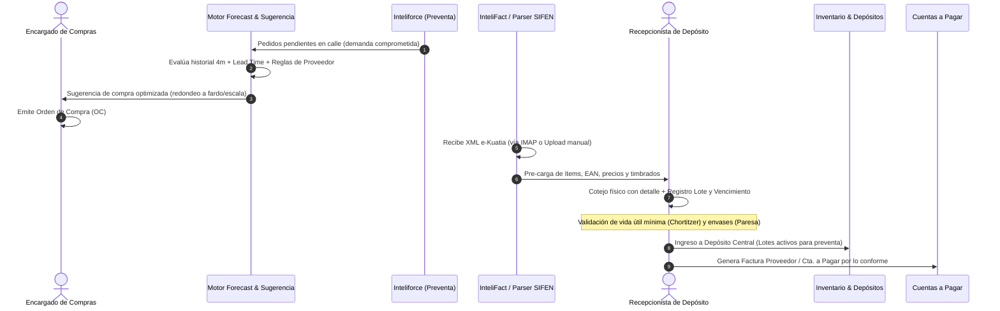

# Especificación Arquitectónica: Motor de Compras Inteligente y Reglas de Proveedores

**Fecha:** 28 de Septiembre de 2026  
**Vertical:** Distribuidora (Casa Gonzalito)  
**Estado:** Aprobado en Brainstorming  
**Autor:** Antigravity & Equipo de Ingeniería  

---

## 1. Resumen Ejecutivo y Objetivos

El objetivo de esta iniciativa es dotar a la vertical de **Distribuidora de Intelimarket (Casa Gonzalito)** de un **Motor de Compras de Vanguardia** que reemplace por completo la operativa manual y rígida del sistema legacy (`columbia`), integrándolo de forma sinérgica con:
1. **Inteliforce**: Para capturar en tiempo real los pedidos de preventa levantados en calle y descontar la demanda comprometida antes de quebrar stock.
2. **InteliFact**: Para importar, parsear y cotejar automáticamente las facturas electrónicas XML SIFEN (e-Kuatia) emitidas por los proveedores nacionales.
3. **Reglas Comerciales Específicas**: Adaptadas a la idiosincrasia de los principales proveedores locales de consumo masivo paraguayo:
   - **PARESA (Coca-Cola)**: Bonificaciones a costo ₲ 0, control de envases retornables/cajones en comodato y múltiplos de fardos.
   - **CHORTITZER (Trébol)**: Cadena de frío, semáforo de vida útil mínima aceptable en muelle y circuito de canjes por vencimiento/rotura.
   - **TROCIUK (Harinas/Alimentos)**: Compras por tonelada/pallet, conversor a bolsas de 50 kg y escalas de costo por volumen de compra.

---

## 2. Arquitectura del Ecosistema y Flujo de Información

---

## 3. Especificación Detallada de Componentes

### 3.1. Perfiles de Reglas Comerciales por Proveedor (`supplier_rules`)

Cada proveedor cuenta con una parametrización de reglas aplicables en compra y recepción:

1. **PARESA**:
   - `admite_bonificaciones`: Booleano. Permite renglones de producto con costo unitario ₲ 0 o prorrateo contable sin alterar bases imponibles de IVA.
   - `control_envases`: Booleano. Mantiene una cuenta corriente de envases retornables (cajones plásticos y botellas de vidrio en comodato), exigiendo registrar en la recepción cuántos cajones vacíos se devuelven al fletero.
   - `unidad_compra_minima`: Fardo / Pack (fuerza que las cantidades sugeridas u ordenadas sean múltiplos del pack, ej. x6 o x12).
2. **CHORTITZER**:
   - `vida_util_minima_dias`: Entero (ej. 20 días). Si el operario ingresa una fecha de vencimiento con menos de $N$ días respecto a la fecha de recepción:
     - Estado **Rojo / Bloqueo**: No permite recepcionar sin código de autorización de supervisor.
     - Estado **Ámbar**: Notificación de rotación acelerada prioritaria para preventa.
   - `circuito_canjes`: Habilita la emisión de comprobante de devolución física en muelle por mercadería averiada/vencida.
3. **TROCIUK**:
   - `unidad_manejo_dual`: Conversión automática entre Kg, Bolsas (50 kg) y Toneladas.
   - `escalas_costo_volumen`: Tabla de rangos (ej. 1 a 5 ton: ₲ X; 6 a 15 ton: ₲ Y; > 15 ton: ₲ Z) para validar que el costo facturado coincida con el acuerdo comercial.

---

### 3.2. Motor de Demanda y Sugerencia Automática de OC

El cálculo se ejecuta en el backend mediante `api/src/purchases/service.py` con la siguiente formulación matemática:

$$\text{Ventas Diarias Ponderadas} (V_d) = \frac{V_{\text{actual}} \times 0.4 + V_{m-1} \times 0.3 + V_{m-2} \times 0.2 + V_{m-3} \times 0.1}{120}$$

$$\text{Stock Comprometido en Preventa} (S_c) = \sum \text{items de pedidos Inteliforce en estado 'pendiente' o 'en\_ruta'}$$

$$\text{Stock Virtual Disponible} (S_v) = S_{\text{físico}} - S_c + S_{\text{en\_tránsito}}$$

$$\text{Target Stock} = V_d \times (\text{Lead Time} + \text{Días Cobertura Deseados}) + \text{Stock Seguridad}$$

$$\text{Déficit Base} = \max(0, \text{Target Stock} - S_v)$$

$$\text{Cantidad Sugerida} = \text{RedondearAlMúltiploSuperior}(\text{Déficit Base}, \text{UnidadCompra})$$

*Disparador de Bonificación:* Si $\text{Cantidad Sugerida}$ está a menos de un 10% del umbral de bonificación del proveedor, el sistema genera la sugerencia proactiva:
> *"Comprando $K$ unidades adicionales alcanzás la escala de bonificación de [Proveedor]."*

---

### 3.3. Ingesta y Cotejo SIFEN (XML e-Kuatia)

- **Fuentes de entrada**:
  1. Subida manual del archivo XML DTE desde el modal de recepción o bandeja de compras.
  2. Consulta automática o sincronización IMAP cPanel (casilla de compras de Casa Gonzalito).
- **Procesamiento (`sifen_xml_parser.py`)**:
  - Extracción de cabecera: CDC (44 dígitos), Número de Factura (`NNN-NNN-NNNNNNN`), Timbrado, RUC Emisor y Receptor, Fecha Emisión, Condición (Contado / Crédito y Plazo).
  - Extracción de renglones: Código producto emisor, Código EAN (código de barras), Descripción, Cantidad, Precio Unitario, Descuento, Tasa de IVA (10%, 5%, Exenta).
  - **Matching inteligente (`matching_service.py`)**: Asocia cada ítem del XML con el catálogo de productos de Intelimarket por código de barras EAN o pack barcodes.

---

### 3.4. Estación de Recepción en Muelle (Dock Check-In)

- **Interfaz de Operador**:
  - Selección de la Orden de Compra arribada o vinculación automática mediante el XML SIFEN cargado.
  - Tabla de cotejo:
    - *Columna Cantidad Ordenada vs Cantidad Remitida vs Cantidad Recibida*.
    - *Selector de Pack / Presentación* (fardo x6, x12, unidad).
    - *Campo de N° de Lote* (con formateo y memoria de lotes recientes).
    - *Campo de Fecha de Vencimiento* (con semáforo de validación de vida útil mínima en vivo).
    - *Campos de Rechazo* (Cantidad rechazada + selector de motivo: avería, fecha corta, error de ítem).
    - *Ítems Extraordinarios* (productos entregados en el camión que no figuraban en la OC original, con justificación obligatoria).
- **Impacto Transaccional**:
  - Incremento inmediato del stock en el Depósito Central asignado al lote y fecha de vencimiento.
  - Generación de la Factura de Compra en Cuentas a Pagar exclusivamente por las cantidades conformes aceptadas.
  - Generación del Acta de Rechazo/Devolución para reclamo de Nota de Crédito por los faltantes o rechazos.

---

### 3.5. Control de Pesaje y Capacidad de Carga en Camiones (`peso_kg`)

El peso de cada producto es una variable crítica tanto para la logística de compras como para la distribución:
1. **Catálogo con Peso Unitario (`products.peso_kg`)**:
   - Mapeo desde el campo de peso del registro de productos legacy (`columbia.productos`).
   - Soporte en compras para cálculo automático de peso bruto total en recepciones masivas (ej. toneladas de granos/harinas de Trociuk).
2. **Estimación y Validación de Carga en Camión de Reparto (`rescamion`)**:
   - Cada camión de la flota cuenta con su capacidad de carga máxima en kilos (`max_weight_kg` en `ir_vehicle_load_configs`).
   - Al consolidar los pedidos de preventa para un viaje de reparto, el sistema calcula en vivo:
     $$\text{Peso Total del Despacho} = \sum (\text{cantidad\_solicitada} \times \text{peso\_kg})$$
   - **Semáforo de Carga**:
     - *Verde*: $\text{Peso Total} \le 85\%$ de la capacidad del camión.
     - *Ámbar*: $85\% < \text{Peso Total} \le 100\%$ (carga completa óptima).
     - *Rojo*: $\text{Peso Total} > 100\%$ (alerta de sobrecarga por exceso de tonelaje; impide cerrar la hoja de carga sin autorización o sugiere dividir en dos viajes).

---

## 4. Migración e Histórico del Sistema Legacy (`columbia`)

1. **Sincronización de Proveedores**: Mapeo completo de `columbia.proveedor` a `suppliers` manteniendo el RUC-DV unificado y condiciones de pago.
2. **Sincronización de Productos y Peso**: Lectura de `columbia.productos` asegurando la persistencia de `peso_kg`, costos de reposición y códigos de barra.
3. **Sincronización de Compras Históricas**:
   - `columbia.fac_compras` $\rightarrow$ `purchase_orders` / `supplier_invoices`.
   - `columbia.item_compras` $\rightarrow$ `purchase_order_items` / `supplier_invoice_items`.
   - Permite que el motor de sugerencias y la comparación histórica de precios dispongan de datos reales desde el día 1 de puesta en marcha.

---

## 5. Criterios de Aceptación y Pruebas (TDD)

- [ ] **Test 1**: El parser SIFEN procesa correctamente un XML DTE paraguayo y extrae CDC, timbrado, RUC y renglones.
- [ ] **Test 2**: El motor de forecast calcula la cantidad sugerida considerando tanto las ventas históricas como los pedidos pendientes de Inteliforce en calle.
- [ ] **Test 3**: La validación de vida útil mínima de Chortitzer arroja alerta en muelle si la fecha de vencimiento es inferior al umbral configurado.
- [ ] **Test 4**: La recepción con Lote y Vencimiento crea los registros en stock vinculados a su depósito y genera la cuenta a pagar por el saldo neto aceptado.
- [ ] **Test 5**: La consolidación de pedidos para carga en camión calcula el peso total exacto en kg a partir de `products.peso_kg` y alerta ante sobrecargas del vehículo.
- [ ] **Test 6**: La interfaz frontend (`PurchasesPage.tsx`) compila sin errores de TypeScript (`tsc -b`) y opera con inputs monetarios canónicos en Guaraníes.
